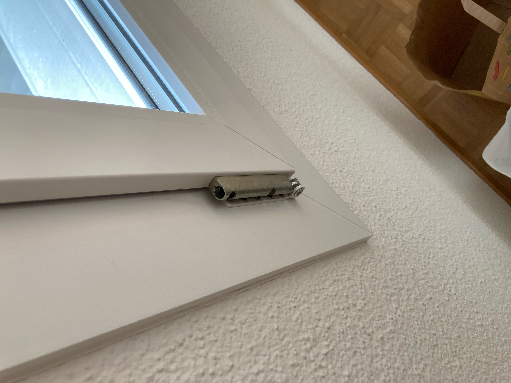

# Defects Tramstr 38. Apartment 13

## Bathroom

One of tiles by the bathtub is really broken and it needs to be fixed. We would like to know if you are going to fix it or we need to fix it for ourselves. For us is specially dangerous since it crack has sharp edges and spikes and we have a little 10 months old that we bath there everyday and it's not the first time he try to touch it. It's definitely a hazard. 

The bathroom ball lid is also broken and scratched. 

## Entrance closet

The right door on the entrance closet has the paint around the pin for locking the door peeled. 

Also, one of the edges of left door on the right closed is not well painted. 

## Windows

One of the trims on the window on the dinning area is missing. 

## Ceiling

Close to the dinning area there is a black stain on the ceiling. 

## Kitchen

Some of the doors on the kitchen cupboards have scratches and dents. 

Also the glass-ceramic stove has a dent on the rim of the glass. 

And the garbage cans and drawer has some damages and rust. 

## Flooring and skirting

The parquet flooring and skirting boards have some damages here and there. Here there are some graphical examples: 

